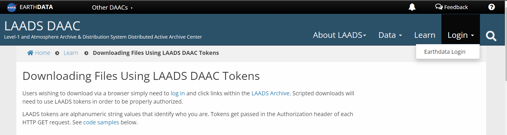
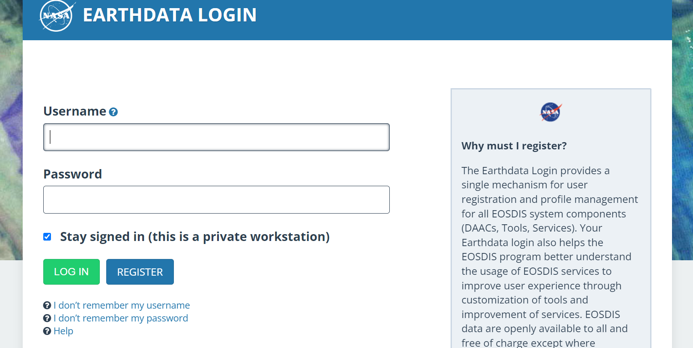
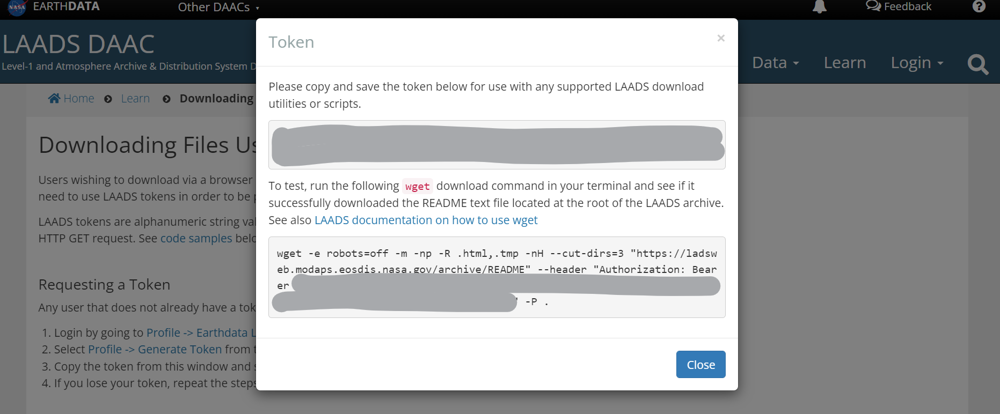

# Installation


### Setting up the Python environment
On the UMD cluster, first load the anaconda module and create a clone environment by typing the 
following commands on the terminal:
```python
module load python/3.8/anaconda
conda create -n UMD --clone=/apps/python/3.7/anaconda
```
On a non-UMD cluster or local machine, download and install the latest anaconda package:
```python
wget -c https://repo.anaconda.com/archive/Anaconda3-2022.05-Linux-x86_64.sh
bash Anaconda3-2022.05-Linux-x86_64.sh
conda create --name UMD
```


```{note}
You can replace UMD with a different environment name of your choice
```


Next copy-paste the following commands into the terminal for both UMD and non-UMD machines:<br>
```
conda activate UMD
conda install -c conda-forge logzero
conda install -c conda-forge netcdf4
conda install -c conda-forge gdal
conda install -c conda-forge rasterio
conda install -c conda-forge pyresample
conda install -c conda-forge cdsapi
conda install -c conda-forge geopandas
conda install -c conda-forge seaborn
conda install -c conda-forge xarray
conda install -c conda-forge rasterstats
conda install -c conda-forge tqdm
conda install -c conda-forge scikit-learn
conda install -c conda-forge jupyterlab
conda install -c conda-forge catboost
conda install -c conda-forge arrow
conda install -c anaconda netcdf4
conda install -c conda-forge cartopy
pip install wget pyModis merf tsfresh pyshp palettable geopy geocoder palettable forestci pangres sklearn-contrib-lightning wget pangres pycountry matplotlib-scalebar
pip install --upgrade git+https://github.com/ritviksahajpal/pygeoutil.git` <br>
```

### Creating a NASA account to download MODIS NDVI
1. Create an account on the [NASA LAADS DAAC](https://ladsweb.modaps.eosdis.nasa.gov/) website
2. Follow the instructions [here](https://ladsweb.modaps.eosdis.nasa.gov/learn/download-files-using-laads-daac-tokens/) 
to request a token for your account <br>
   * Login by going to Profile -> Earthdata Login
 <br>
   
<br>

   * Enter your login credentials or register  
   
 <br>  
  
   * Select Profile -> Generate Token from the top menu 
 <br>
    
 <br>

   * Copy the token from this window and store it somewhere safe and secure 
 <br>
 
3. On your local machine/cluster, iIf not already installed, 
install [octvi](https://pypi.org/project/octvi/)
<br>
4. On the command prompt type `octviconfig` and at the place it asks for a token, 
paste the token you copied earlier.

### Creating a Copernicus account to download AgERA5
1. Create an account on the [CDS](https://cds.climate.copernicus.eu) website 
2. Follow the instructions [here](https://cds.climate.copernicus.eu/api-how-to/)
to install the CDS API key on your local machine/cluster
3. Follow these instructions to install the CDS API Key on your local machine/cluster

     * <b>For Windows users:</b> 
     <br>
       * Login to [CDS](https://cds.climate.copernicus.eu/user/143426/)      
              
<br>        
        * Copy a 2 line code, which shows a url and your own uid:API key details as followed:
        
       * For CDS users, Go to [this](https://cds.climate.copernicus.eu/api-how-to/) page and copy the 2 line code 
       displayed in the black box  as shown below: <br>
        `url:https://cds.climate.copernicus.eu/api/v2`<br>`key: {uid}:{api-key}` 
    
       * Paste the 2 line code into a  %USERPROFILE%\.cdsapirc file, where in your windows environment, %USERPROFILE% is 
       * usually located at C:\Users\Username folder). The CDS API expects to find the .cdsapirc file in your home                   directory. 
<br>         
       * Install the CDS API client by running the following command in a command prompt window:
       `pip3 install cdsapi`
                
       * Once the CDS API client is installed, it can be used to request data from the datasets listed in the CDS and ADS 
       catalogues. It is necessary to agree to the Terms of Use of every datasets that you intend to download. Attached 
       to each dataset download form, the "Show API request" button displays the python code to be used. 
            
   * <b>For Linux users:</b>
     * If you don't have an account, please self register at the [CDS registration page](https://cds.climate.copernicus.eu/user/register?destination=%2F%23!%2Fhome/) 
     * If you are not logged, please [login](https://cds.climate.copernicus.eu/user/login?destination=%2F%23!%2Fhome) and           go to the step below. 
     * Copy the code displayed into HOME/.cdsapirc file (in your Unix/Linux environment).<br>
        `url:https://cds.climate.copernicus.eu/api/v2` <br>`key: {uid}:{api-key}`
<br>                       
     * The CDS API client is a python based library. You can install the CDS API client via the package management system pip, 
     by running on Unix/Linux the command <br>
           `pip install cdsapi`   

* If not already installed, install the `cdsapi` python library by typing `pip install cdsapi` in 
the command prompt.
