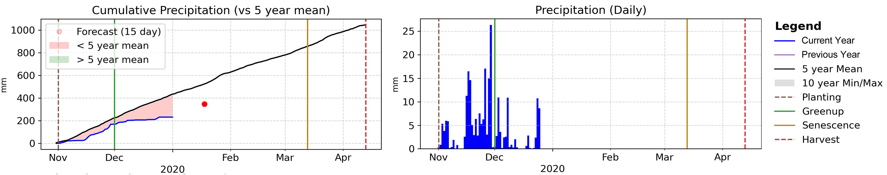

# Precipitation

There are two plots for precipitation, both of which are measured in millimeters. The first 
plot shows the current season’s cumulative precipitation compared to the 5-year mean. When the 
cumulative precipitation goes above the 5-year mean, the area between the current values and 
the 5-year mean is colored in green to indicate above cumulative average rainfall. When the 
cumulative precipitation goes below the 5-year mean, the area between the current values and 
the 5-year mean is colored in red to indicate below average cumulative rainfall. In addition 
to recorded precipitation, the chart shows the 15-day forecast precipitation as a dot, either 
green or red to indicate if the forecast will place the cumulative precipitation up above or 
below the 5-year mean. The second plot shows the daily precipitation events for the season 
across time, helping to identify the evenness of rainfall over time or major rainfall events.

During the course of the season, the timing and the amount of rainfall surpluses or deficits can 
have different effects. As an example, too much rainfall during sowing can prevent farms from 
planting crops and flooding events can cause dramatic yield reductions. Alternatively, not enough 
rainfall early in the season can prevent sown crops from emerging and properly developing.

For more information on using precipitation data for crop monitoring please see the Precipitation 
section of the EO Data.